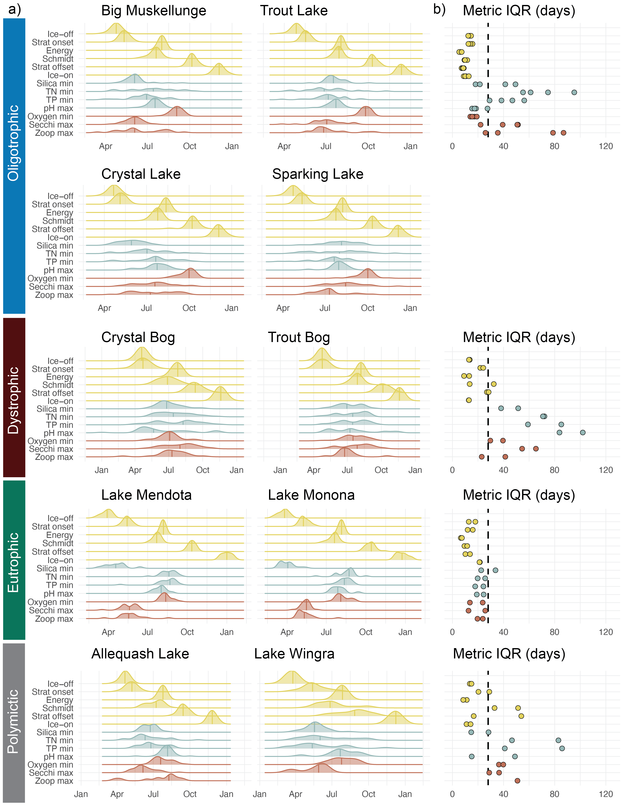

# NTL-LTER Phenology

Scripts and outputs to process the long-term NTL-LTER data by Cal Buelo, Kait Reinl, Robert Ladwig, Hilary Dugan & Paul Hanson.
Associated with manuscript **The Phenology of North-Temperate Lakes: Examining Variability Across Trophic States**

## Datasets
Long-term lake data were obtained from the North Temperate Lakes Long-Term Ecological Research program (#DEB-1440297 and #DEB-2025982).

Package ID: knb-lter-ntl.33.36 Cataloging System:https://pasta.edirepository.org.
Data set title: North Temperate Lakes LTER: Ice Duration - Madison Lakes Area 1853 - current.
"https://pasta.lternet.edu/package/data/eml/knb-lter-ntl/33/36/f5bc02452cafcd461c49bd7429d8b40c" 

Package ID: knb-lter-ntl.32.29 Cataloging System:https://pasta.edirepository.org.
Data set title: North Temperate Lakes LTER: Ice Duration - Trout Lake Area 1981 - current.
"https://pasta.lternet.edu/package/data/eml/knb-lter-ntl/32/29/e57a6b46a237355214844e2c76fa8aa5" 

Package ID: knb-lter-ntl.29.29 Cataloging System:https://pasta.edirepository.org.
Data set title: North Temperate Lakes LTER: Physical Limnology of Primary Study Lakes 1981 - current.
"https://pasta.lternet.edu/package/data/eml/knb-lter-ntl/29/29/03e232a1b362900e0f059859abe8eb97"

Package ID: knb-lter-ntl.1.57 Cataloging System:https://pasta.edirepository.org.
Data set title: North Temperate Lakes LTER: Chemical Limnology of Primary Study Lakes: Nutrients, pH and Carbon 1981 - current.
"https://pasta.lternet.edu/package/data/eml/knb-lter-ntl/1/57/802d63a4c35050b09ef6d1e7da3efd3f"
  
Package ID: knb-lter-ntl.31.29 Cataloging System:https://pasta.edirepository.org.
Data set title: North Temperate Lakes LTER: Secchi Disk Depth; Other Auxiliary Base Crew Sample Data 1981 - current.
"https://pasta.lternet.edu/package/data/eml/knb-lter-ntl/31/29/5a5a5606737d760b61c43bc59460ccc9" 

Package ID: knb-lter-ntl.90.33 Cataloging System:https://pasta.edirepository.org.
Data set title: North Temperate Lakes LTER: Zooplankton - Madison Lakes Area 1997 - current.
"https://pasta.lternet.edu/package/data/eml/knb-lter-ntl/90/33/5880c7ba184589e239aec9c55f9d313b"

Package ID: knb-lter-ntl.37.36 Cataloging System:https://pasta.edirepository.org.
Data set title: North Temperate Lakes LTER: Zooplankton - Trout Lake Area 1982 - current.
"https://pasta.lternet.edu/package/data/eml/knb-lter-ntl/37/36/c4b652eea76cd431ac5fd3562b1837ee" 

## Getting started
This package is structured as a {{targets}} pipeline so that the workflow is reproducible. The pipeline is set up to run 1) Data pull and cleaning, 2) Data merging, and 3) Figure output and analyses. The pipeline and workflow be run easily using tar_make(). The first time you run this, you may get errors about missing packages. Install those and then try again.

First, you will need the `targets` and `qs` packages. Then, you will need any other package listed next to the argument `packages` in the `tar_option_set()`function call near the top of the `_targets.R` file. 

Once you have successfully installed those packages, run the following lines to build the full pipeline. Note that the inventory take 30 minutes to run.

```r
library(targets)
tar_make()
```

## Output: Phenological metrics across lakes
<!-- -->
